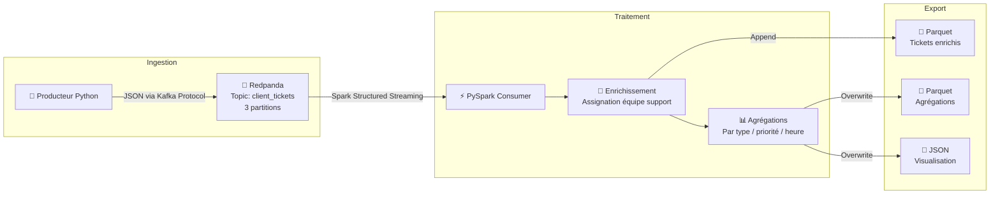

# 🏭 InduTechData - POC Gestion de Tickets Clients

> Pipeline temps réel de gestion de tickets clients avec **Redpanda** et **PySpark**

## 📋 Contexte

InduTechData, spécialisée dans l'analyse de données industrielles, a besoin d'un système de gestion de tickets clients capable d'ingérer, traiter et analyser les demandes en temps réel. Ce POC démontre la faisabilité technique de cette solution en utilisant Redpanda comme plateforme de streaming et PySpark pour le traitement analytique.

## 🏗️ Architecture du Pipeline



## 📦 Structure du Projet

```
indutech-tickets-poc/
├── docker-compose.yml          # Orchestration de la stack complète
├── README.md                   # Documentation (ce fichier)
├── producer/
│   ├── Dockerfile              # Image Python pour le producteur
│   ├── requirements.txt        # confluent-kafka, faker
│   └── producer.py             # Génération de tickets temps réel
├── spark-consumer/
│   ├── Dockerfile              # Image Spark pour le consommateur
│   ├── requirements.txt        # pyspark
│   └── consumer.py             # Traitement et agrégations PySpark
├── output/                     # Résultats exportés (monté en volume)
│   ├── enriched_tickets/       # Tickets enrichis (Parquet)
│   ├── agg_by_type/            # Agrégation par type (Parquet)
│   ├── agg_by_priority/        # Agrégation par priorité (Parquet)
│   ├── agg_hourly_volume/      # Volume horaire (Parquet)
│   ├── agg_top_clients/        # Top clients (Parquet)
│   ├── json_by_type/           # Par type (JSON)
│   └── json_by_priority/       # Par priorité (JSON)
└── docs/
    └── architecture-hybride.png  # Schéma exercice 1
```

## 🚀 Lancement Rapide

### Prérequis

- Docker & Docker Compose installés
- 4 Go de RAM disponibles minimum

### Démarrage

```bash
# Cloner le repository
git clone <url-du-repo>
cd indutech-tickets-poc

# Lancer toute la stack
docker-compose up --build
```

### Vérification

```bash
# Vérifier que Redpanda est opérationnel
docker exec -it redpanda rpk cluster info

# Vérifier que le topic existe
docker exec -it redpanda rpk topic list

# Consommer quelques messages manuellement
docker exec -it redpanda rpk topic consume client_tickets --num 5

# Vérifier les fichiers de sortie
ls -la output/
```

### Arrêt

```bash
docker-compose down -v
```

## 🎫 Format des Tickets

Chaque ticket contient les champs suivants :

| Champ | Type | Description | Exemple |
|-------|------|-------------|---------|
| `ticket_id` | string | Identifiant unique | `TK-A1B2C3D4` |
| `client_id` | string | Identifiant client | `CLI-0023` |
| `created_at` | string (ISO 8601) | Date/heure de création | `2026-02-21T14:30:00Z` |
| `request` | string | Description de la demande | `Capteur IoT ne remonte plus...` |
| `request_type` | string | Catégorie | `incident_technique` |
| `priority` | string | Niveau de priorité | `high` |

**Exemple de message JSON :**

```json
{
    "ticket_id": "TK-A1B2C3D4",
    "client_id": "CLI-0023",
    "created_at": "2026-02-21T14:30:00.000000Z",
    "request": "Capteur IoT ne remonte plus de données depuis 2h",
    "request_type": "incident_technique",
    "priority": "high"
}
```

## ⚡ Transformations Appliquées

### 1. Enrichissement - Assignation d'équipe de support

Chaque ticket est automatiquement routé vers l'équipe compétente :

| Type de demande | Équipe assignée |
|-----------------|-----------------|
| `incident_technique` | Équipe Infrastructure |
| `demande_information` | Support Client N1 |
| `demande_evolution` | Équipe Produit |
| `maintenance` | Équipe Opérations |
| `facturation` | Service Comptabilité |

### 2. Agrégations produites

- **Par type de demande** : nombre de tickets par catégorie et équipe assignée
- **Par priorité** : distribution des tickets selon le niveau de priorité
- **Volume horaire** : nombre de tickets par heure de la journée
- **Top clients** : les 10 clients avec le plus de tickets

## 🛠️ Choix Techniques

| Composant | Technologie | Justification |
|-----------|-------------|---------------|
| Streaming | Redpanda | Compatible API Kafka, léger (pas de JVM), faible latence |
| Traitement | PySpark Structured Streaming | Scalabilité horizontale, API DataFrame, windowing natif |
| Sérialisation | JSON | Lisible, flexible, adapté au POC |
| Export analytique | Parquet | Colonnaire, compressé, typé, standard data engineering |
| Export visualisation | JSON | Interopérable avec les outils BI |
| Conteneurisation | Docker Compose | Orchestration simple, reproductible, un seul `docker-compose up` |

## 📹 Démonstration Vidéo

> [Lien vers la vidéo de démonstration](URL_A_REMPLIR)

La vidéo montre le lancement complet du POC et le parcours du flux de données de bout en bout.

## 📄 Licence

Projet académique - InduTechData POC - Master 2 Data Engineering
