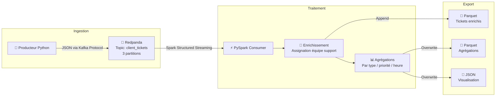

<div align="center">

# 🚀⚡ InduTechData — Pipeline streaming temps réel

### POC de gestion de tickets clients avec Redpanda (Kafka API) et PySpark Structured Streaming

[](https://www.python.org/)
[](https://redpanda.com/)
[](https://spark.apache.org/)
[](https://www.docker.com/)
[](https://parquet.apache.org/)
[](LICENSE)

**[Contexte](#-contexte)** • **[Architecture](#%EF%B8%8F-architecture-du-pipeline)** • **[Démarrage](#-lancement-rapide)** • **[Choix techniques](#%EF%B8%8F-choix-techniques)** • **[Démo vidéo](#-démonstration-vidéo)**

</div>

---

## 📋 Contexte

**InduTechData**, spécialisée dans l'analyse de données industrielles, a besoin d'un système de gestion de tickets clients capable d'**ingérer, traiter et analyser** les demandes **en temps réel**. Ce POC démontre la faisabilité technique de cette solution en utilisant **Redpanda** comme plateforme de streaming (compatible Kafka API) et **PySpark Structured Streaming** pour le traitement analytique.

L'enjeu : passer d'un traitement batch quotidien à une **architecture événementielle** permettant de réagir aux tickets dès leur création, avec assignation automatique aux équipes de support et agrégations en continu pour le pilotage opérationnel.

> 🎯 **Objectif** : démontrer en POC qu'une architecture streaming permet à InduTechData de traiter les tickets dès leur arrivée, sans attendre un batch nocturne.

---

## 🎯 Objectifs

- ✅ **Ingérer** des tickets clients en continu via un broker Kafka-compatible
- ✅ **Enrichir** chaque ticket par assignation automatique d'équipe hde support
- ✅ **Agréger** en temps réel les volumes par type, priorité, heure, client
- ✅ **Exporter** les résultats dans des formats appropriés (Parquet pour analytics, JSON pour BI)
- ✅ **Conteneuriser** toute la stack pour reproductibilité (`docker-compose up`)

---

## 🏗️ Architecture du pipeline



---

## 🛠️ Stack technique

| Composant | Technologie | Rôle |
|-----------|-------------|------|
| **Streaming broker** | Redpanda | Plateforme événementielle compatible API Kafka, sans JVM |
| **Compute** | PySpark Structured Streaming | Traitement et agrégation temps réel |
| **Sérialisation** | JSON | Format des messages dans Redpanda |
| **Stockage analytique** | Apache Parquet | Stockage colonnaire compressé typé |
| **Stockage visualisation** | JSON | Format interopérable pour outils BI |
| **Conteneurisation** | Docker Compose | Orchestration de la stack complète |

---

## 📦 Structure du projet

```
Kafka-spark-streaming-pipeline/
├── docker-compose.yml             # Orchestration de la stack complète
├── README.md                      # Ce fichier
├── producer/
│   ├── Dockerfile                 # Image Python pour le producteur
│   ├── requirements.txt           # confluent-kafka, faker
│   └── producer.py                # Génération de tickets temps réel
├── spark-consumer/
│   ├── Dockerfile                 # Image Spark pour le consommateur
│   ├── requirements.txt           # pyspark
│   └── consumer.py                # Traitement et agrégations PySpark
├── output/                        # Résultats exportés (monté en volume)
│   ├── enriched_tickets/          # Tickets enrichis (Parquet)
│   ├── agg_by_type/               # Agrégation par type (Parquet)
│   ├── agg_by_priority/           # Agrégation par priorité (Parquet)
│   ├── agg_hourly_volume/         # Volume horaire (Parquet)
│   ├── agg_top_clients/           # Top clients (Parquet)
│   ├── json_by_type/              # Par type (JSON)
│   └── json_by_priority/          # Par priorité (JSON)
└── docs/
    └── architecture-hybride.png   # Schéma exercice 1
```

---

## 🚀 Lancement rapide

### Prérequis

- Docker & Docker Compose installés
- 4 Go de RAM disponibles minimum

### Démarrage

```bash
# Cloner le repository
git clone https://github.com/Melkia44/Kafka-spark-streaming-pipeline.git
cd Kafka-spark-streaming-pipeline

# Lancer toute la stack
docker compose up --build
```

### Vérification

```bash
# Vérifier que Redpanda est opérationnel
docker exec -it redpanda rpk cluster info

# Vérifier que le topic existe
docker exec -it redpanda rpk topic list

# Consommer quelques messages manuellement
docker exec -it redpanda rpk topic consume client_tickets --num 5

# Vérifier les fichiers de sortie
ls -la output/
```

### Arrêt

```bash
docker compose down -v
```

---

## 🎫 Format des tickets

Chaque ticket contient les champs suivants :

| Champ | Type | Description | Exemple |
| --- | --- | --- | --- |
| `ticket_id` | string | Identifiant unique | `TK-A1B2C3D4` |
| `client_id` | string | Identifiant client | `CLI-0023` |
| `created_at` | string (ISO 8601) | Date/heure de création | `2026-02-21T14:30:00Z` |
| `request` | string | Description de la demande | `Capteur IoT ne remonte plus...` |
| `request_type` | string | Catégorie | `incident_technique` |
| `priority` | string | Niveau de priorité | `high` |

**Exemple de message JSON** :

```json
{
    "ticket_id": "TK-A1B2C3D4",
    "client_id": "CLI-0023",
    "created_at": "2026-02-21T14:30:00.000000Z",
    "request": "Capteur IoT ne remonte plus de données depuis 2h",
    "request_type": "incident_technique",
    "priority": "high"
}
```

---

## ⚡ Transformations appliquées

### 1. Enrichissement — Assignation d'équipe de support

Chaque ticket est automatiquement routé vers l'équipe compétente :

| Type de demande | Équipe assignée |
| --- | --- |
| `incident_technique` | Équipe Infrastructure |
| `demande_information` | Support Client N1 |
| `demande_evolution` | Équipe Produit |
| `maintenance` | Équipe Opérations |
| `facturation` | Service Comptabilité |

### 2. Agrégations produites

- **Par type de demande** : nombre de tickets par catégorie et équipe assignée
- **Par priorité** : distribution des tickets selon le niveau de priorité
- **Volume horaire** : nombre de tickets par heure de la journée
- **Top clients** : les 10 clients avec le plus de tickets

---

## 🧠 Choix techniques

### Pourquoi Redpanda plutôt que Kafka ?

| Critère | Avantage Redpanda |
| --- | --- |
| **Pas de JVM** | Démarrage plus rapide, empreinte mémoire moindre |
| **API Kafka compatible** | Aucune réécriture du code producer/consumer si migration future |
| **Faible latence** | Adapté aux POC où la simplicité prime |
| **Setup minimal** | Pas de Zookeeper à gérer |

### Pourquoi PySpark Structured Streaming ?

| Critère | Justification |
| --- | --- |
| **Scalabilité horizontale** | Évolutivité native si volumes augmentent |
| **API DataFrame** | Code plus lisible que Spark Streaming "classique" |
| **Windowing natif** | Agrégations temporelles directement supportées |
| **Tolérance aux pannes** | Checkpointing intégré pour exactly-once |

### Pourquoi Parquet pour le stockage analytique ?

- ✅ **Colonnaire** : projections rapides sur peu de colonnes
- ✅ **Compressé** : empreinte disque réduite (Snappy par défaut)
- ✅ **Typé** : pas de cast à la lecture
- ✅ **Standard** data engineering : compatible Spark, DuckDB, Pandas, Polars, Athena, BigQuery, etc.

### Conteneurisation full Docker

Orchestration simple, environnement reproductible, **un seul `docker compose up`** suffit à démarrer producer + broker + consumer + exports.

---

## 📹 Démonstration vidéo

> 🎬 **[Lien vers la vidéo de démonstration](https://youtu.be/QHaMQH5Bh0U)**

La vidéo montre le lancement complet du POC et le parcours du flux de données de bout en bout.

---

## 🌱 Aller plus loin (V2)

- 📈 **Schema Registry** (Avro ou Protobuf) pour gérer l'évolution du format des messages
- 🔄 **Exactly-once semantics** via configuration fine de Spark + Redpanda
- 🌐 **Kafka Connect** pour brancher d'autres sources/sinks (PostgreSQL CDC, S3, Elasticsearch)
- 📊 **Monitoring temps réel** via Grafana + Prometheus exporters Redpanda/Spark
- 🤖 **ML en streaming** : scoring de priorité automatique via Spark MLlib
- 🌍 **Multi-broker** : passage de Redpanda single-node à cluster Redpanda 3+ nœuds (HA)

---

## ℹ️ Note

Le repository a été initialement publié sous le nom `Cloud-infrastructure-modeling` puis renommé en `Kafka-spark-streaming-pipeline` pour mieux refléter son contenu réel. GitHub redirige automatiquement les anciennes URLs.

---

## 👤 Auteur

**Mathieu Lowagie**  
Data Engineer | Service Delivery Manager — 17 ans d'expérience B2B télécoms

🔗 [LinkedIn](https://www.linkedin.com/in/mathieu-pm/) • 💼 [GitHub](https://github.com/Melkia44)

---

## 📄 Licence

Projet réalisé dans le cadre du **Master 2 Data Engineering** (OpenClassrooms — Projet 9 *"Modélisez une infrastructure dans le cloud"*).

Distribué sous licence **MIT** — voir [LICENSE](LICENSE) pour les détails.
